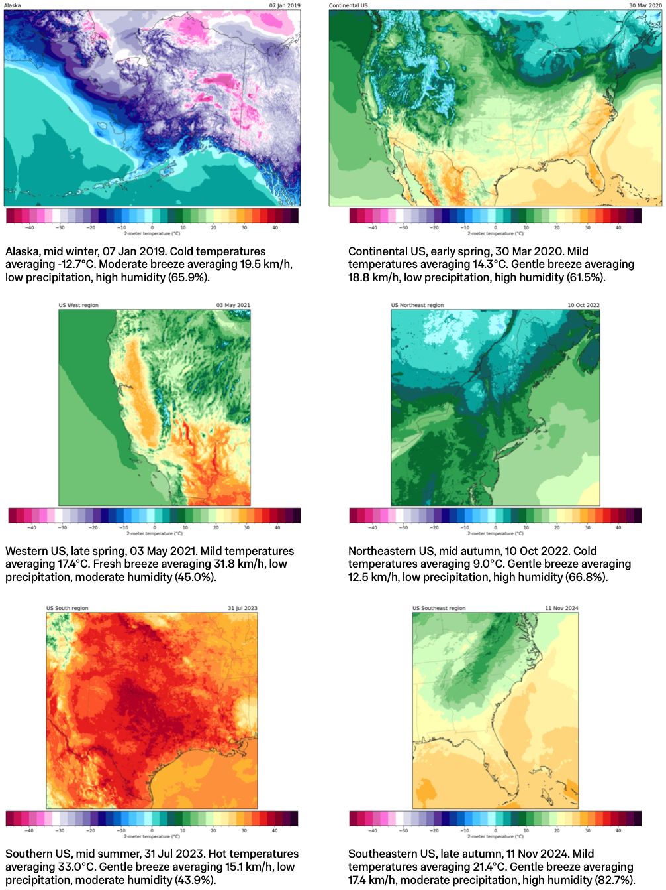

[](https://code.visualstudio.com)
[](https://docs.astral.sh/uv/getting-started/installation/)
[](https://www.python.org/downloads/release/python-3132)
[](https://pytorch.org/get-started/locally/)
[](https://huggingface.co/AdamMuhtar/HRRR-ALL-SigLIP)
[](https://opensource.org/license/mit)
<a href="https://colab.research.google.com/github/adammuhtar/hrrr-vlm/blob/main/notebooks/hrrr-all-siglip.ipynb" target="_parent"></a>

# HRRR VLM
This repository contains code to fine-tune SigLIP vision-language models (VLMs) using publicly available meteorological datasets; specifically, the [High-Resolution Rapid Refresh (HRRR)](https://rapidrefresh.noaa.gov/hrrr/) dataset from the [National Oceanic and Atmospheric Administration (NOAA)](https://www.noaa.gov). This project is part the dissertation work done for the partial fulfilment of the requirements for the MSc in Machine Learning and Data Science (MLDS) at Imperial College London.


## Table of Contents
- [HRRR VLM](#hrrr-vlm)
  - [Table of Contents](#table-of-contents)
  - [Overview](#overview)
  - [Directory Structure](#directory-structure)
  - [Usage](#usage)
    - [Installation via `uv`](#installation-via-uv)
    - [Installation via standard Python](#installation-via-standard-python)

## Overview
This repo contains a practical recipe for adapting a CLIP-based VLMs to a scientific domain—meteorology. Off-the-shelf VLMs learn from broad web data and often miss specialist patterns, terms, and scales that matter in weather-related subjects. We bridge that gap by building a multi-scale image–caption corpus from NOAA’s High-Resolution Rapid Refresh (HRRR) data and fine-tuning SigLIP via low-rank adaptation (LoRA).

**What this project does**
- **Builds a dataset** of temperature heatmaps and weather captions at **continental and regional scales**, so the model learns scale-aware representations (see sample image-caption pairs below).
- **Adapts SigLIP using LoRA**, a parameter-efficient fine-tuning approach that’s fast to train and easy to reproduce.
- **Evaluates retrieval and embeddings**, showing better cross-modal retrieval than baselines and **climate-coherent clustering** in the learned embedding space.
- **Checks downstream signal** via a linear probe (logistic regression) for **hurricane occurrence**, revealing predictive signal even without task-specific training.

The full dataset and LoRA adapters can be obtained at the following links:
* https://huggingface.co/datasets/AdamMuhtar/NOAA-HRRR-HRRRAK-All-ImageCaption
* https://huggingface.co/datasets/AdamMuhtar/NOAA-HRRR-CONUS-ImageCaption
* https://huggingface.co/AdamMuhtar/HRRR-ALL-SigLIP
* https://huggingface.co/AdamMuhtar/HRRR-CONUS-SigLIP



## Directory Structure
```plaintext
hrrr-vlm/
├── .vscode/
├── data/
├── images/
├── logs/
├── notebooks/
├── scripts/
├── src/
│   └── hrrr_vlm/
│       ├── data/
│       ├── eval/
│       ├── train/
│       └── utils/
├── tests/
│   ├── data/
│   ├── eval/
│   └── train/
├── .gitignore
├── .python-version
├── CITATION.cff
├── LICENSE
├── pyproject.toml
├── README.md
├── requirements.txt
└── uv.lock
```

## Usage
We provide examples of use in the notebooks folder. This first requires the installation of the `hrrr-vlm` package, which can be done via the following methods.

### Installation via [`uv`](https://docs.astral.sh/uv/getting-started/installation/)
We recommend using [`uv`](https://docs.astral.sh/uv/getting-started/installation/) to build the `hrrr-vlm` package, which can be done via the following commands
```bash
uv sync --locked
```

### Installation via standard Python
Alternatively, this package could also be built via Python's standard pip module, via the following commands:
```bash
python -m pip install .
```